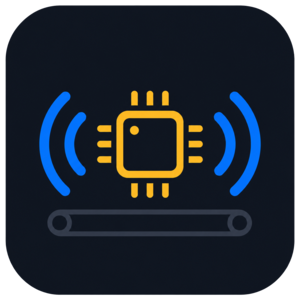

<p align="center">
  
</p>

# TitanBridge

An ESP32-C6 firmware that bridges a **Titan treadmill** to a **Garmin watch** and **Home Assistant**, since the treadmill has no native Garmin or FTMS support over a standard profile.

## Features

- Reads real-time belt speed from the treadmill over BLE
- Exposes a Running Speed & Cadence (RSC) sensor that Garmin watches can connect to
- Reports speed, running state, and Garmin connection state to Home Assistant via Zigbee

## Hardware

- [Seeed XIAO ESP32-C6](https://wiki.seeedstudio.com/xiao_esp32c6_getting_started/)
- Titan treadmill (BLE address `c8:1f:c2:2a:90:40`)

## Build

Requires [arduino-cli](https://arduino.github.io/arduino-cli/) with the `esp32` core installed.

```bash
arduino-cli compile --fqbn "esp32:esp32:XIAO_ESP32C6:ZigbeeMode=ed,PartitionScheme=zigbee" titanbridge
arduino-cli upload  --fqbn "esp32:esp32:XIAO_ESP32C6:ZigbeeMode=ed,PartitionScheme=zigbee" --port /dev/ttyACM0 titanbridge
```

Both FQBN options (`ZigbeeMode=ed` and `PartitionScheme=zigbee`) are required — using the default partition scheme causes a boot crash.

## Home Assistant setup

The device joins as a Zigbee end device and exposes three entities:

| Entity | Type | Description |
|--------|------|-------------|
| `sensor.titanbridge_treadmillspeed` | Speed (km/h) | Current belt speed |
| `binary_sensor.titanbridge_treadmillrunning` | Boolean | Belt is moving |
| `binary_sensor.titanbridge_garminconnected` | Boolean | Garmin watch is connected |

After flashing or a full flash erase, re-pair the device in Home Assistant via **Settings → Devices & Services → Add Device**.

## Garmin setup

The bridge advertises as a Running Speed & Cadence sensor named **TitanBridge**. Add it as a sensor in your Garmin activity profile (Walk on Treadmill / Run on Treadmill). If you have a foot pod registered, disable it in the activity sensor settings to avoid conflicts.

## LED status

| Pattern | Meaning |
|---------|---------|
| Solid | Both Garmin and treadmill connected |
| Slow blink | Garmin connected, treadmill reconnecting |
| Fast blink | Neither connected |

## Project structure

```
titanbridge/        Main firmware sketch
explorer/           One-shot BLE explorer (lists treadmill services/characteristics)
scanner/            BLE scanner
heartbeat/          Minimal heartbeat test sketch
```

See [CLAUDE.md](CLAUDE.md) for technical implementation details.
